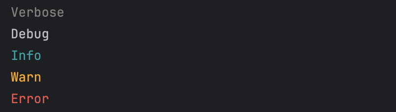

# debugln

Dead simple logging for Kotlin Multiplatform apps. Supports: Android, iOS, JVM, Browser (JS/WASM), NodeJS targets.

## Installation

```kotlin
repositories {
    mavenCentral()
}

dependencies {
    implementation("com.alexstyl:debugln:1.0.3")
}
```

## Quick tutorial

```kotlin
// these will be printed in the console
verboseln { "Verbose" }
debugln { "Debug" }
infoln { "Info" }
warnln { "Warn" }
errorln { "Error" }

// disables logging
allowLogging = false

verboseln { "Verbose" }
debugln { "Debug" }
infoln { "Info" }
warnln { "Warn" }
errorln { "Error" }
```

Will print the following in the respective platform's console:



## Contributing

We are currently accepting contributions in the form of bug reports and feature requests, in the form of Github issues.
